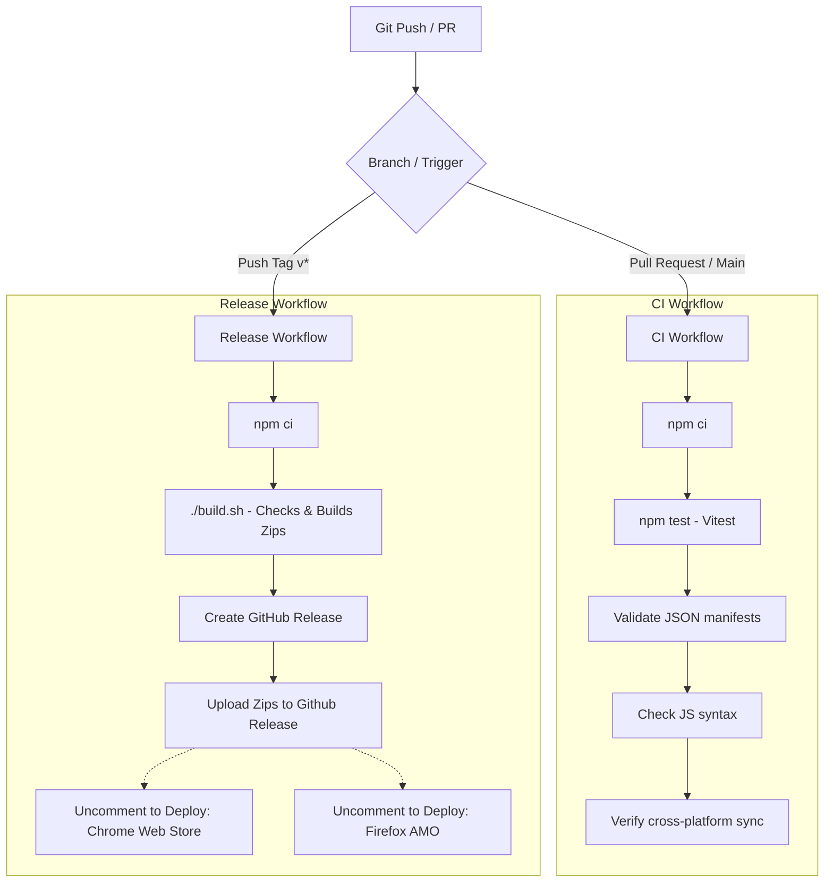

# Intention — DevOps & Storefront Deployment Guide

This guide details how to automate builds and set up continuous deployment (CD) pipelines to publish **Intention** straight to the extension storefronts (Chrome, Firefox, Safari) and mobile app stores (Android, iOS).

---

## 📦 Build Pipeline & Artifacts

All builds are driven by the `./build.sh` script, which automates preflight verification, testing, cross-platform syncing, and packaging.

| Command | Targets Built / Synced | Artifact Outputs |
| :--- | :--- | :--- |
| `./build.sh` | Chrome Zip + Firefox Zip + Android Sync | `build/intention-chrome-v{VERSION}.zip`<br>`build/intention-firefox-v{VERSION}.zip` |
| `./build.sh --android` | Android Assets Sync | Syncs shared HTML/CSS/JS code to Android assets folder |
| `./build.sh --safari` | Safari wrapper app | Compiles Safari macOS App to `build/` |
| `./build.sh --all` | Chrome + Firefox + Safari + Android | All zips, Safari app build, and Android asset sync |

---

## 🚀 Storefront Automation Setup

### 1. Google Chrome Web Store

Updates to the Chrome Web Store are automated via the release workflow using the Google Web Store API.

#### Pre-requisites
1. **Initial Upload:** You must upload the extension zip manually to the [Chrome Developer Dashboard](https://developer.chrome.com/docs/webstore/developer-dashboard/) at least once to create the extension ID.
2. **Enable Web Store API:** Go to the [Google Cloud Console](https://console.cloud.google.com/), create a project, search for **Chrome Web Store API**, and enable it.
3. **Generate OAuth Credentials:**
   - Go to APIs & Services → Credentials.
   - Create an OAuth Client ID (Application type: Desktop App).
   - Record the Client ID and Client Secret.
4. **Get Refresh Token:** Retrieve the OAuth Refresh Token using Google's OAuth playground or curl, authorizing it for scope `https://www.googleapis.com/auth/chromewebstore`.

#### GitHub Repository Secrets
Add these secrets in your GitHub repository settings under **Settings → Secrets and variables → Actions**:

*   `CHROME_EXTENSION_ID`: The unique ID of your Chrome Web Store listing.
*   `CHROME_CLIENT_ID`: Your Google Developer OAuth Client ID.
*   `CHROME_CLIENT_SECRET`: Your Google Developer OAuth Client Secret.
*   `CHROME_REFRESH_TOKEN`: The authorized OAuth Refresh Token.

To activate, uncomment the `# Publish to Chrome Web Store` block in [`.github/workflows/release.yml`](file:///.github/workflows/release.yml).

---

### 2. Firefox Add-ons (AMO)

Updates to Firefox Add-ons are automated via the release workflow using Mozilla's signing API.

#### Pre-requisites
1. **Initial Upload:** Upload the extension manually to the [Firefox Add-on Developer Hub](https://addons.mozilla.org/developers/) to establish the extension GUID (`intention@maybeitsadam`).
2. **Generate Credentials:**
   - Go to your profile settings → API Keys on the AMO Developer Hub.
   - Generate your credentials: **JWT Issuer** and **JWT Secret**.

#### GitHub Repository Secrets
Add these secrets to your GitHub repository:

*   `AMO_JWT_ISSUER`: Your AMO JWT Issuer key.
*   `AMO_JWT_SECRET`: Your AMO JWT Secret token.

To activate, uncomment the `# Publish to Firefox Add-ons (AMO)` block in [`.github/workflows/release.yml`](file:///.github/workflows/release.yml).

---

### 3. Apple App Store (macOS & iOS Safari Wrapper)

The Safari web extension is wrapped in a native Xcode project under `Intention Apple/`. 

#### Building Locally
Run:
```bash
./build.sh --safari
```
This runs the preflight check, converts assets, runs `xcodebuild`, and copies `Intention Safari.app` into the `build/` folder.

#### App Store Connect Automation (Fastlane)
To automate submissions to the Apple App Store, we recommend using [Fastlane](https://fastlane.tools/).
1. **Initialize Fastlane** in the Xcode project:
   ```bash
   cd "Intention Apple"
   fastlane init
   ```
2. **Configure App Store Connect API Key:**
   Store your App Store Connect API Key (Issuer ID, Key ID, and `.p8` key file contents) as GitHub Secrets.
3. **Configure Match/Certificates:**
   Use Fastlane `match` to manage signing certificates and provisioning profiles securely inside a private Git repository or cloud storage.
4. **Create a Deployment Lane:**
   Add a `release` lane in your `Fastfile` to build and upload to TestFlight or the App Store Connect:
   ```ruby
   lane :release do
     setup_ci
     match(type: "appstore")
     increment_build_number(xcodeproj: "Intention Safari.xcodeproj")
     build_app(
       workspace: "Intention Safari.xcworkspace",
       scheme: "Intention Safari (macOS)",
       output_directory: "../build"
     )
     upload_to_app_store(
       api_key_path: "fastlane/api_key.json"
     )
   end
   ```

---

### 4. Google Play Store (Android App Wrapper)

The Android app version is in `Intention Android/`. It wraps the options and coaching HTML files inside Kotlin WebViews, communicating via a custom Javascript bridge (`android-bridge.js`) and intercepts app launches using a native **Accessibility Service**.

#### Building & Asset Syncing
To build the Android App, the extension assets must first be synced:
```bash
./build.sh --android
```
This copies the HTML/CSS/JS files to `Intention Android/app/src/main/assets/`.

#### Build APK / Release Bundle (AAB)
You can build the app using Android Studio or command-line Gradle:
```bash
cd "Intention Android"
./gradlew assembleRelease # Compiles APK
./gradlew bundleRelease   # Compiles App Bundle (AAB) for Play Store
```

#### Play Store Signing & Publishing
To automate Play Store submissions:
1. **Create Upload Keystore:** Generate a signing key using keytool or Android Studio.
2. **Store Keystore in Secrets:** Base64 encode your `.jks` or `.keystore` file and store it in GitHub Secrets as `ANDROID_KEYSTORE_BASE64`, alongside key aliases and passwords (`ANDROID_KEY_ALIAS`, `ANDROID_KEYSTORE_PASSWORD`, `ANDROID_KEY_PASSWORD`).
3. **Configure Fastlane Supply:** 
   Initialize Fastlane in the Android project to automatically upload build artifacts (AAB) to Google Play tracks (Internal, Alpha, Beta, Production).
   - Generate a Service Account JSON key from your Google Play Console / Google Cloud Console.
   - Save the key file content as `PLAY_SERVICE_ACCOUNT_JSON` in GitHub Secrets.

---

## 🛠 CI/CD Pipeline Structure



---

## 🔒 Critical Rules for DevOps / Engineers

1. **Do Not Modify Shared JS/CSS Directly:**
   All files in the `SHARED_FILES` list must remain byte-identical across the platforms (Chrome, Firefox, Safari wrapper). If they drift, CI/CD validation will fail. Apply modifications to `Intention Chrome/` first, then run `./build.sh` to compile/sync to Firefox, Apple, and Android.
2. **Never Commit Secrets:**
   Ensure `env.txt` and developer configuration files are kept in `.gitignore`. Store all release credentials and signing certificates inside secure GitHub Secrets.
