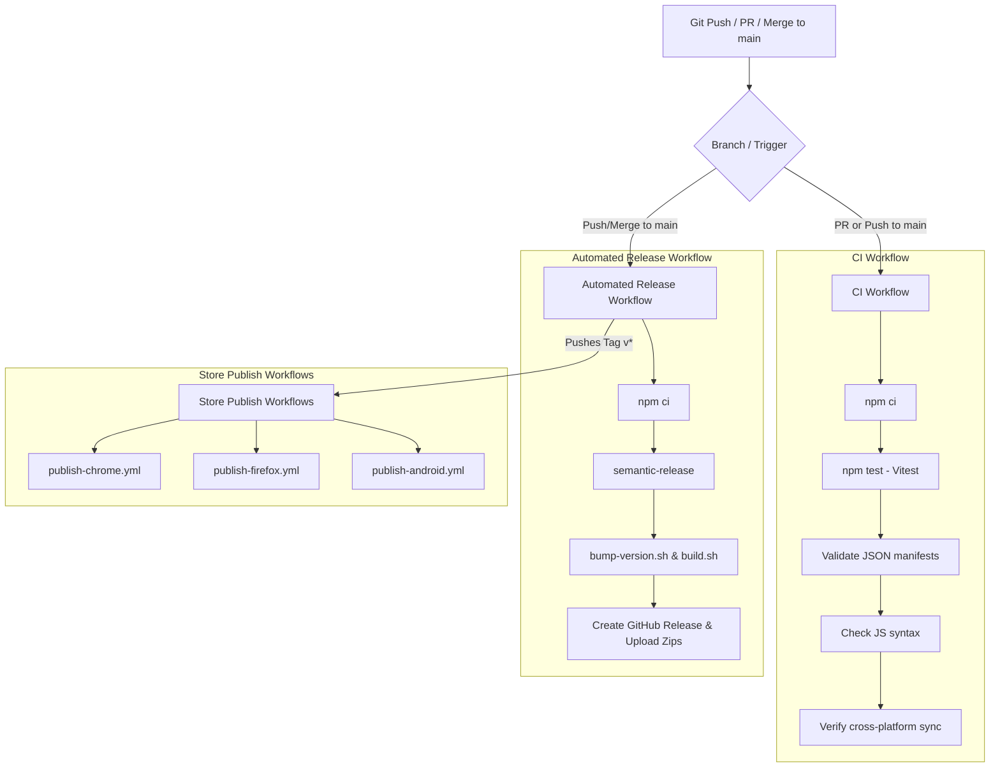

# Intention — DevOps & Storefront Deployment Guide

This guide details how to automate builds and set up continuous deployment (CD) pipelines to publish **Intention** straight to the extension storefronts (Chrome, Firefox, Safari) and mobile app stores (Android, iOS).

---

## 📦 Build Pipeline & Artifacts

All builds are driven by the `./build.sh` script, which automates preflight verification, testing, cross-platform syncing, and packaging.

| Command | Targets Built / Synced | Artifact Outputs |
| :--- | :--- | :--- |
| `./build.sh` | Chrome Zip + Firefox Zip + Android Sync | `build/intention-chrome-v{VERSION}.zip`<br>`build/intention-firefox-v{VERSION}.zip` |
| `./build.sh --android` | Android Assets Sync | Syncs shared HTML/CSS/JS code to Android assets folder |
| `./build.sh --safari` | Safari wrapper app | Compiles Safari macOS App to `build/` |
| `./build.sh --all` | Chrome + Firefox + Safari + Android | All zips, Safari app build, and Android asset sync |

---

## 🚀 Storefront Automation Setup

### 1. Google Chrome Web Store

Updates to the Chrome Web Store are automated via the release workflow using the Google Web Store API.

#### Pre-requisites
1. **Initial Upload:** You must upload the extension zip manually to the [Chrome Developer Dashboard](https://developer.chrome.com/docs/webstore/developer-dashboard/) at least once to create the extension ID.
2. **Enable Web Store API:** Go to the [Google Cloud Console](https://console.cloud.google.com/), create a project, search for **Chrome Web Store API**, and enable it.
3. **Generate OAuth Credentials:**
   - Go to APIs & Services → Credentials.
   - Create an OAuth Client ID (Application type: Desktop App).
   - Record the Client ID and Client Secret.
4. **Get Refresh Token:** Retrieve the OAuth Refresh Token using Google's OAuth playground or curl, authorizing it for scope `https://www.googleapis.com/auth/chromewebstore`.

#### GitHub Repository Secrets
Add these secrets in your GitHub repository settings under **Settings → Secrets and variables → Actions**:

*   `CHROME_EXTENSION_ID`: The unique ID of your Chrome Web Store listing.
*   `CHROME_CLIENT_ID`: Your Google Developer OAuth Client ID.
*   `CHROME_CLIENT_SECRET`: Your Google Developer OAuth Client Secret.
*   `CHROME_REFRESH_TOKEN`: The authorized OAuth Refresh Token.

The storefront publishing triggers automatically on tag creation once secrets are configured.

---

### 2. Firefox Add-ons (AMO)

Updates to Firefox Add-ons are automated via the release workflow using Mozilla's signing API.

#### Pre-requisites
1. **Initial Upload:** Upload the extension manually to the [Firefox Add-on Developer Hub](https://addons.mozilla.org/developers/) to establish the extension GUID (`intention@maybeitsadam`).
2. **Generate Credentials:**
   - Go to your profile settings → API Keys on the AMO Developer Hub.
   - Generate your credentials: **JWT Issuer** and **JWT Secret**.

#### GitHub Repository Secrets
Add these secrets to your GitHub repository:

*   `AMO_JWT_ISSUER`: Your AMO JWT Issuer key.
*   `AMO_JWT_SECRET`: Your AMO JWT Secret token.

The storefront publishing triggers automatically on tag creation once secrets are configured.

---

### 3. Apple App Store (macOS & iOS Safari Wrapper)

The Safari web extension is wrapped in a native Xcode project under `Intention Apple/` (targets: App + Extension for both iOS and macOS, plus four iOS-only extensions — Monitor, Shield, Shield Action, Report). App Store Connect app ID: `6791299221`. Team: `6NQNU5YSC2`.

#### Building Locally (unsigned)
Run:
```bash
./build.sh --safari
```
This runs the preflight check, converts assets, runs `xcodebuild`, and copies `Intention Safari.app` into the `build/` folder. Plain local build only — no distribution signing, no upload.

#### App Store Connect Automation (Fastlane + match)

Uploads are automated end-to-end from the CLI via [Fastlane](https://fastlane.tools/) + [match](https://docs.fastlane.tools/actions/match/) — the same pattern the open-parliament repo uses. No Xcode GUI is needed for signing or upload.

Lanes live in `Intention Apple/fastlane/Fastfile`:
```bash
cd "Intention Apple"
bundle exec fastlane ios beta   # archive -> Intention.ipa -> upload to App Store Connect
bundle exec fastlane mac beta   # archive -> Intention.pkg -> upload to App Store Connect
```

Each lane:
1. Runs `match` (type `appstore`) to fetch/create the App Store distribution provisioning profiles for that platform's bundle IDs, pulling the encrypted cert/profile bundle from the shared `MaybeItsSoftware/match-certs` git repo — the same repo and team distribution certificate other maybeitssoftware apps use; `match` only needs to create new *profiles* per app, not a new cert.
2. Switches the relevant Xcode targets to manual signing pointed at whatever profile `match` just resolved (never a hardcoded name — profile names differ by platform; macOS profiles get a `" macos"` suffix to disambiguate from the iOS profile sharing the same bundle ID).
3. Archives and exports (`build_app`), producing a signed `.ipa` (iOS) or `.pkg` (macOS) under `build/ios/` or `build/macos/`.
4. Uploads the binary to App Store Connect via `upload_to_testflight`, authenticated with an App Store Connect API key — no Apple ID/2FA prompts.

**Secrets** — stored in the repo root `.env` (the Fastfile loads it explicitly via `Dotenv.load`, since Fastlane's built-in dotenv support only checks `fastlane/.env`):

| Variable | How to get it |
|---|---|
| `ASC_KEY_ID` / `ASC_ISSUER_ID` / `ASC_KEY_CONTENT` | Create an App Store Connect API key at **Users and Access → Integrations → App Store Connect API**, role **App Manager** or **Admin** (needed for both provisioning-profile management and uploads). `ASC_KEY_CONTENT` is the base64 of the downloaded `.p8`: `base64 -i AuthKey_XXXX.p8`. |
| `MATCH_PASSWORD` | Passphrase that decrypts the shared `match-certs` repo. |
| `TEAM_ID` | Optional — defaults to `6NQNU5YSC2` in the Fastfile. |

You also need SSH access to `git@github.com:MaybeItsSoftware/match-certs.git` (same deploy key/identity used for open-parliament) so `match` can push newly created profiles.

This is currently a **local/manual step** — unlike Chrome/Firefox/Android there's no `publish-apple.yml`, so it doesn't run on a tag push. Run the two `bundle exec fastlane` commands by hand after a release. Wiring this into a tag-triggered GitHub Actions workflow (needs a macOS runner) would be a natural next step if unattended publishing is wanted.

**Gotchas already worked out** (so nobody has to re-discover them):
- Fastlane's `platform` block must be named `:mac`, not `:macos` — pass `platform: "macos"` as a string param to `match`/`build_app` instead.
- macOS App Store export (a `.pkg`) needs a separate **Mac Installer Distribution** certificate beyond the Apple Distribution app-signing cert — fetched via `match(..., additional_cert_types: ["mac_installer_distribution"])`.
- Every scheme built via CLI must be *shared* (`Intention Safari.xcodeproj/xcshareddata/xcschemes/*.xcscheme`, committed to git) — `fastlane`/`gym` can't see per-user local-only schemes. `Intention Safari (macOS)` wasn't originally shared; it is now.
- The macOS target's Info.plist needs `LSApplicationCategoryType` set (`INFOPLIST_KEY_LSApplicationCategoryType` build setting, currently `"public.app-category.productivity"`) or Apple's validator rejects the upload with a 409.

---

### 4. Google Play Store (Android App Wrapper)

The Android app version is in `Intention Android/`. It wraps the options and coaching HTML files inside Kotlin WebViews, communicating via a custom Javascript bridge (`android-bridge.js`) and intercepts app launches using a native **Accessibility Service**.

#### Building & Asset Syncing
To build the Android App, the extension assets must first be synced:
```bash
./build.sh --android
```
This copies the HTML/CSS/JS files to `Intention Android/app/src/main/assets/`.

#### Build APK / Release Bundle (AAB)
You can build the app using Android Studio or command-line Gradle:
```bash
cd "Intention Android"
./gradlew assembleRelease # Compiles APK
./gradlew bundleRelease   # Compiles App Bundle (AAB) for Play Store
```

#### Play Store Signing & Publishing
To automate Play Store submissions:
1. **Create Upload Keystore:** Generate a signing key using keytool or Android Studio.
2. **Store Keystore in Secrets:** Base64 encode your `.jks` or `.keystore` file and store it in GitHub Secrets as `ANDROID_KEYSTORE_BASE64`, alongside key aliases and passwords (`ANDROID_KEY_ALIAS`, `ANDROID_KEYSTORE_PASSWORD`, `ANDROID_KEY_PASSWORD`).
3. **Configure Fastlane Supply:** 
   Initialize Fastlane in the Android project to automatically upload build artifacts (AAB) to Google Play tracks (Internal, Alpha, Beta, Production).
   - Generate a Service Account JSON key from your Google Play Console / Google Cloud Console.
   - Save the key file content as `PLAY_SERVICE_ACCOUNT_JSON` in GitHub Secrets.

---

## 🛠 CI/CD Pipeline Structure



---

## 🔒 Critical Rules for DevOps / Engineers

1. **Do Not Modify Shared JS/CSS Directly:**
   All files in the `SHARED_FILES` list must remain byte-identical across the platforms (Chrome, Firefox, Safari wrapper). If they drift, CI/CD validation will fail. Apply modifications to `Intention Chrome/` first, then run `./build.sh` to compile/sync to Firefox, Apple, and Android.
2. **Never Commit Secrets:**
   Ensure `env.txt` and developer configuration files are kept in `.gitignore`. Store all release credentials and signing certificates inside secure GitHub Secrets.
